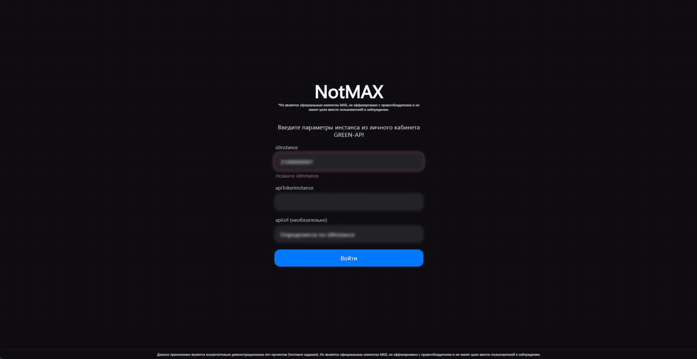
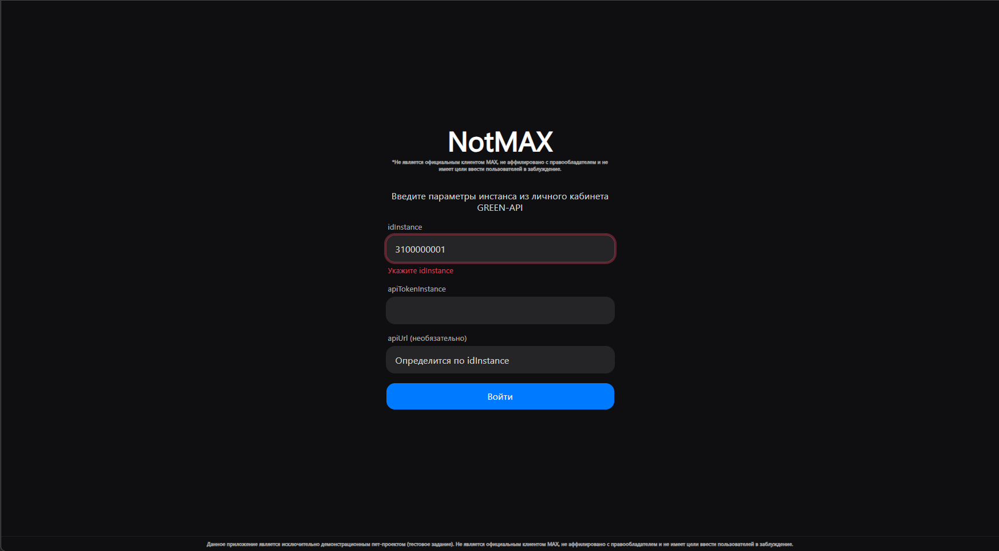
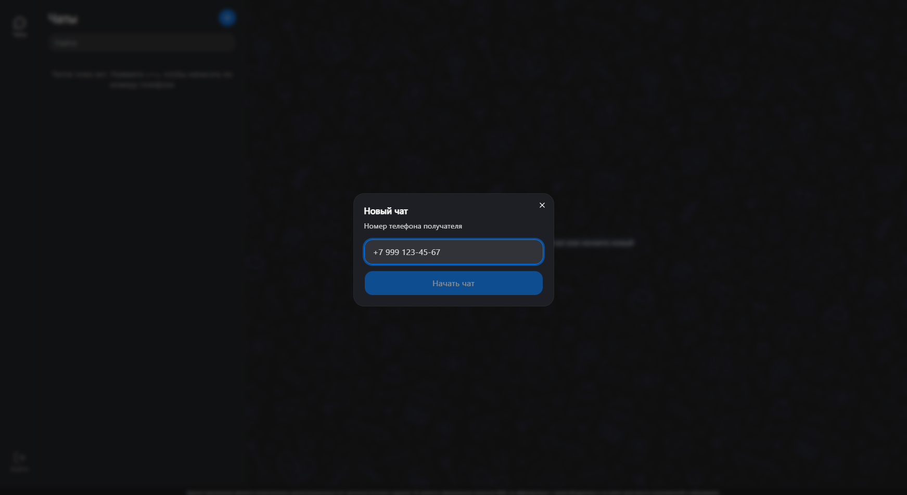
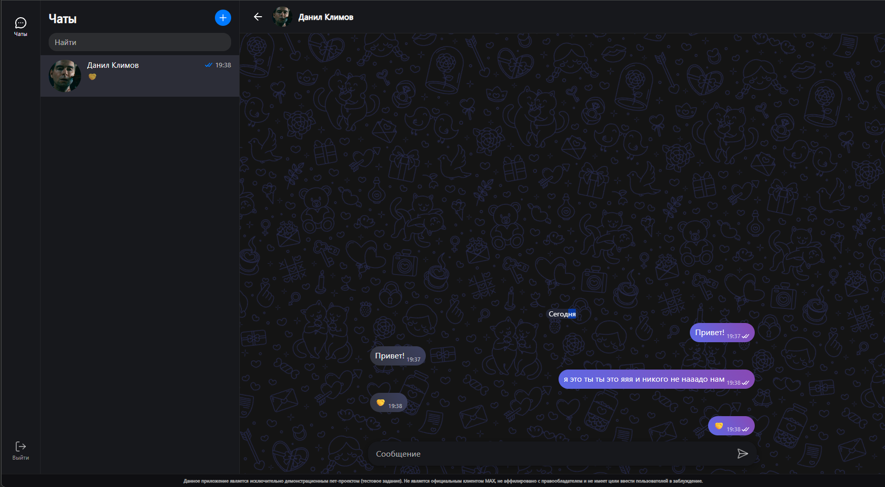

# NotMAX

**Данное приложение является исключительно демонстрационным пет-проектом (тестовое задание). Не является официальным клиентом MAX, не аффилировано с правообладателем и не имеет цели ввести пользователей в заблуждение.**

Веб-интерфейс для отправки и получения текстовых сообщений в MAX через [GREEN-API](https://green-api.com/max). Внешний вид чата повторяет web.max.ru.

Демо: https://lyoraeth.github.io/greenapi-max-chat/



| Вход | Новый чат | Чат |
|---|---|---|
|  |  |  |

## Возможности

Сценарий из задания:

- вход по `idInstance` и `apiTokenInstance` из личного кабинета GREEN-API;
- создание чата по номеру телефона получателя;
- отправка текстовых сообщений;
- получение ответов собеседника.

Сверх сценария:

- статусы доставки и прочтения, счетчик непрочитанных;
- аватары собеседников, поиск по чатам, разделители дат;
- изменяемая ширина списка чатов, раскладка для телефона;
- история чатов между перезагрузками страницы.

> Часть этих сценариев (статусы, аватарки) изначально не планировалась, однако в процессе исследования и тестирования эндпоинтов GREEN-API уже были разобраны - вследствие чего их было решено интегрировать в клиент. Остальные решения сверх требований (разделители дат, адаптивная раскладка, история чатов) были добавлены ради сходства с прототипом и базового удобства приложения.

## Запуск

Нужны Node.js 22+ и pnpm.

```bash
pnpm install
pnpm dev
```

Приложение откроется на http://localhost:5173.

Чтобы не вводить параметры инстанса при каждом запуске, скопируйте `.env.example` в `.env` и заполните его. Значения используются только в `pnpm dev` и в сборку не попадают.

Остальные команды:

```bash
pnpm build    # сборка в dist/
pnpm preview  # просмотр сборки
pnpm test     # юнит-тесты
pnpm lint     # линтер
```

## Подготовка инстанса

1. Создать инстанс MAX в [личном кабинете](https://console.green-api.com) и авторизовать его по QR-коду.
2. Поле `webhookUrl` в настройках инстанса оставить пустым.
3. Включить уведомления о входящих сообщениях, о статусах и о сообщениях, отправленных через API (`incomingWebhook`, `outgoingWebhook`, `outgoingAPIMessageWebhook`). Если они выключены, приложение сообщит об этом и предложит включить их само; после этого инстанс перезапускается, настройки применяются до 5 минут.

`apiUrl` определяется по `idInstance`. Если у инстанса другой хост, его можно указать в третьем поле формы входа.

## Используемые методы API

| Задача | Метод |
|---|---|
| Проверка параметров входа | `getStateInstance` |
| Проверка и включение уведомлений | `getSettings`, `setSettings` |
| Поиск получателя по номеру | `checkAccount` |
| Аватар собеседника | `getAvatar` |
| Отправка сообщения | `sendMessage` |
| Получение сообщений и статусов | `receiveNotification`, `deleteNotification` |

## Как переносился внешний вид

Стили прототипа снимались скриптом [tools/dump-styles.js](tools/dump-styles.js). Он вставляется в консоль devtools на web.max.ru и по вызову `dump($0)` выдает дерево выбранного элемента: для каждого узла размер, примененные CSS-свойства, состояния (`:hover`, `:active`) и значения использованных CSS-переменных. Объявления, общие для всех узлов, выносятся в начало, одинаковые соседние узлы сворачиваются в одну строку.

По этим выгрузкам сверстаны навигация, список чатов, шапка чата, сообщения, разделитель дат и поле ввода. Размеры, отступы, цвета и типографика в основном взяты из них напрямую. То, что выгружать было избыточно (счетчик непрочитанных, раскладка для телефона, отдельные отступы), подобрано отдельно. Этот подход позволил заметно ускорить верстку.

Из прототипа перенесены только значения стилей. Код, иконки и графика НЕ используются из соображений интеллектуальной собственности.

## Ограничения

- Параметры входа хранятся в `sessionStorage` и уходят только на хост GREEN-API.
- История сообщений хранится в `localStorage` браузера и удаляется при выходе. Сообщения, отправленные до первого входа или с другого устройства, не подгружаются.
- Очередь уведомлений у инстанса одна: вторая открытая вкладка или другой клиент заберут часть сообщений.
- Номера получателей: только Россия (+7) и Беларусь (+375), это ограничение API.
- На тарифе Developer доступно три чата.

## Стек

React 19, TypeScript, Vite, Tailwind CSS, Shadcn/ui, Vitest.

## Использованные материалы

| Что | Откуда |
|---|---|
| API отправки и получения сообщений | [GREEN-API](https://green-api.com/max), HTTP API для MAX |
| Внешний вид: раскладка, размеры, цвета | [web.max.ru](https://web.max.ru), взят за прототип по условию задания; код и графика оттуда не используются |
| Фоновый узор чата | обои Telegram из набора [«32 Telegram SVG Wallpapers»](https://www.figma.com/community/file/1262473551582577153/32-telegram-svg-wallpapers) (Ellen Milien, Figma Community) |
| Иконки | [Lucide](https://lucide.dev), лицензия ISC; отметки статуса сообщений нарисованы отдельно |
| Компоненты кнопки, поля ввода и диалога | [shadcn/ui](https://ui.shadcn.com) на [Base UI](https://base-ui.com), лицензия MIT |

## Лицензия

Код опубликован для ознакомления в рамках тестового задания, права на
повторное использование не предоставляются. Сторонние материалы
(фоновый узор, иконки, компоненты) принадлежат их авторам и
распространяются на их условиях.
